<p align="center">
  
</p>

<h1 align="center">Church Hub</h1>

<p align="center">
  <strong>A modern, feature-rich church presentation and livestream management system</strong>
</p>

<p align="center">
  <a href="#-download">Download</a> •
  <a href="#-features">Features</a> •
  <a href="#-tech-stack">Tech Stack</a> •
  <a href="#-getting-started">Getting Started</a>
</p>

---

## 🎯 Overview

Church Hub is a comprehensive church presentation software designed to streamline worship services. It combines song lyrics management, Bible verse display, service scheduling, multi-screen presentation, YouTube/OBS livestream integration, background music player, and song key tracking into a single, elegant application.

Built with modern web technologies and powered by Tauri, Church Hub runs as a native desktop application on Windows, macOS, and Linux, while also being accessible via web browser.

---

## 📥 Download

<p align="center">
  <a href="https://github.com/radio-crestin/church-hub/releases/latest">
    
  </a>
</p>

<table align="center">
  <tr>
    <td align="center">
      <a href="https://github.com/radio-crestin/church-hub/releases/latest/download/church-hub-windows-x64.exe">
        
        <br/>
        <sub><b>Windows (x64)</b></sub>
        <br/>
        <sub>⬇️ <code>.exe</code> installer</sub>
      </a>
    </td>
    <td align="center">
      <a href="https://github.com/radio-crestin/church-hub/releases/latest/download/church-hub-macos-arm64.dmg">
        
        <br/>
        <sub><b>macOS (Apple Silicon)</b></sub>
        <br/>
        <sub>⬇️ <code>.dmg</code> installer</sub>
      </a>
    </td>
  </tr>
</table>

> **🍎 macOS Note:** If you see *"church-hub.app is damaged and can't be opened"*, run this in Terminal:
> ```bash
> xattr -c /Applications/church-hub.app
> ```

---

## ✨ Features

### 🎛️ Control Room

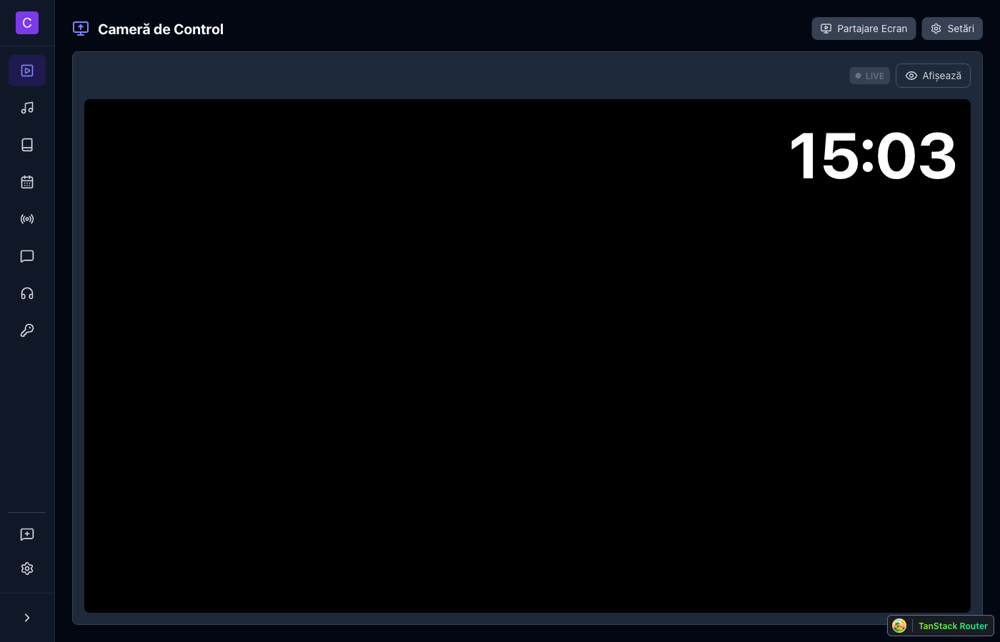

> Main presentation interface with live preview and presentation queue

- ▶️ **Live Preview** — See exactly what's displayed on screen
- 📋 **Presentation Queue** — Drag & drop to reorder items
- ⌨️ **Keyboard Navigation** — Quick slide control with hotkeys
- 🖥️ **Multi-Screen** — Primary, stage, livestream & kiosk outputs

---

### 🎵 Songs Library

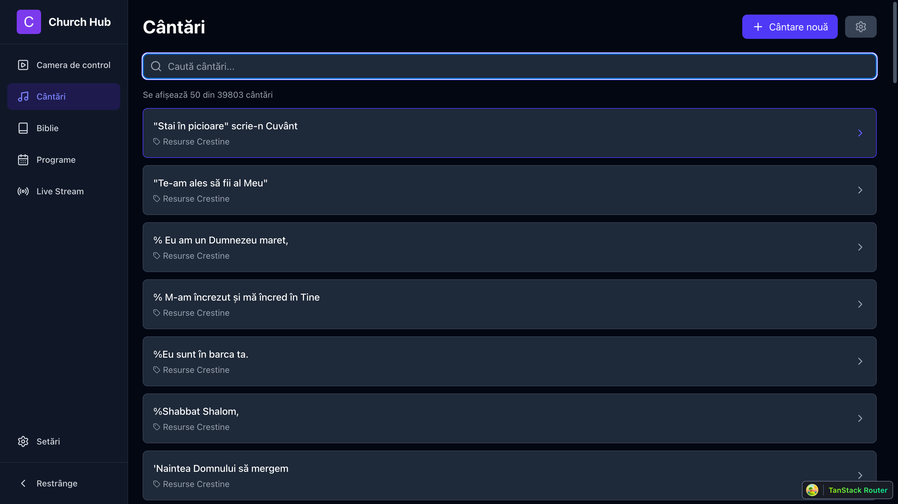

> Browse and search through 40,000+ songs instantly

- 🔍 **Fast Search** — Full-text search across all songs
- 🏷️ **Categories** — Organize with custom tags
- 📥 **Smart Import** — OpenSong & PowerPoint formats
- 🔄 **Duplicate Detection** — Prevents duplicates automatically

---

### 📝 Song Viewer

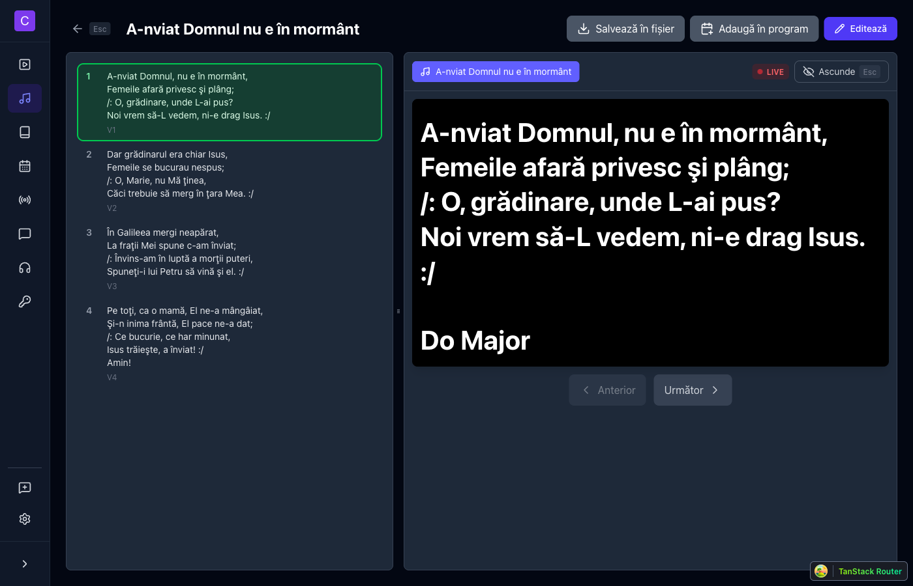

> View and present song lyrics with slide navigation

- 📑 **Slide Navigation** — Easy verse/chorus switching
- ✏️ **Slide Editor** — Edit lyrics with markers (V1, C, B)
- 📋 **CCLI Support** — Track license & copyright info
- ➕ **Add to Queue** — One-click add to presentation

---

### 📖 Bible

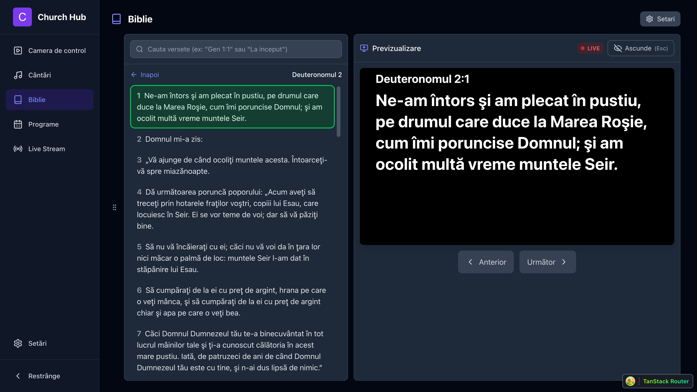

> Search and display Bible verses with live preview

- 🔎 **Smart Search** — By reference (`Gen 1:1`) or keyword
- 📚 **Multiple Translations** — Support for various versions
- 📑 **Quick Navigation** — Browse all books easily
- 👁️ **Live Preview** — See verses before presenting

---

### 📋 Service Programs

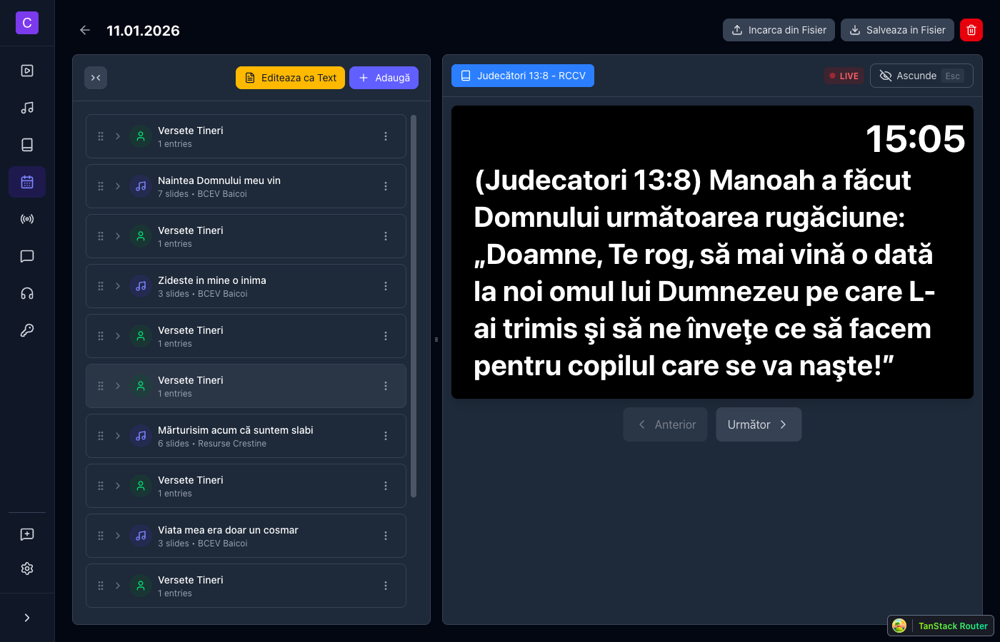
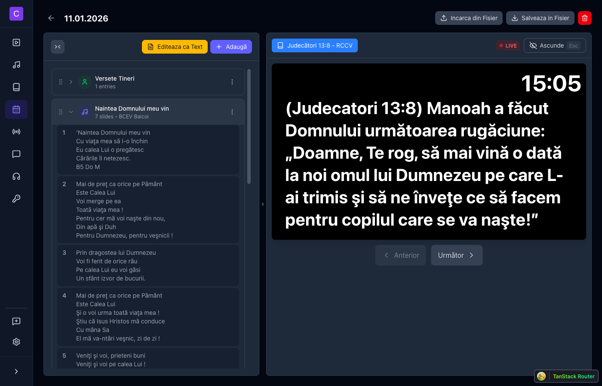

> Create and manage service schedules

- 📝 **Schedule Builder** — Songs, verses & custom slides
- 🖱️ **Drag & Drop** — Intuitive item reordering
- 💾 **Import/Export** — Share programs as files
- ⚡ **Quick Load** — Import entire program to queue

---

### 🔴 Live Stream

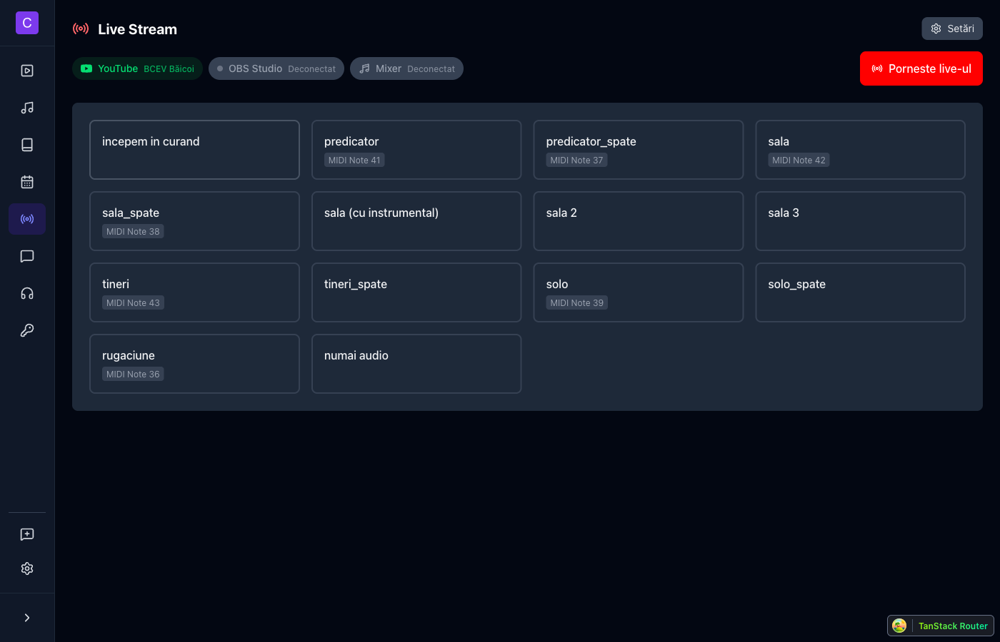

> YouTube livestream and OBS Studio integration

- ▶️ **One-Click Start** — Launch YouTube broadcasts
- 🎬 **OBS Scenes** — Switch scenes from the app
- 🤖 **Auto-Switch** — Scenes change with content type
- 🎚️ **Mixer Control** — Audio mixer integration (16+ ch)

---

### 🎵 Music Player

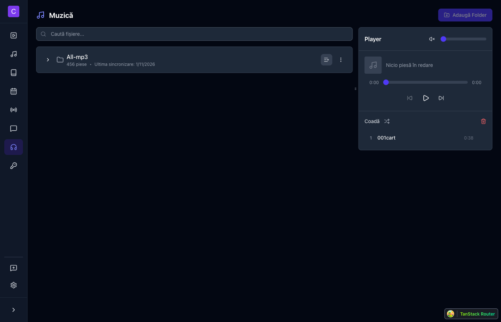

> Background music player for worship services

- 📁 **Folder Support** — Organize music by folders
- 🎵 **Queue Management** — Build and manage playlists
- 🔀 **Shuffle Mode** — Randomize playback order
- 🔊 **Volume Control** — Independent volume slider
- ▶️ **Playback Controls** — Play, pause, skip tracks

---

### 🎹 Song Key

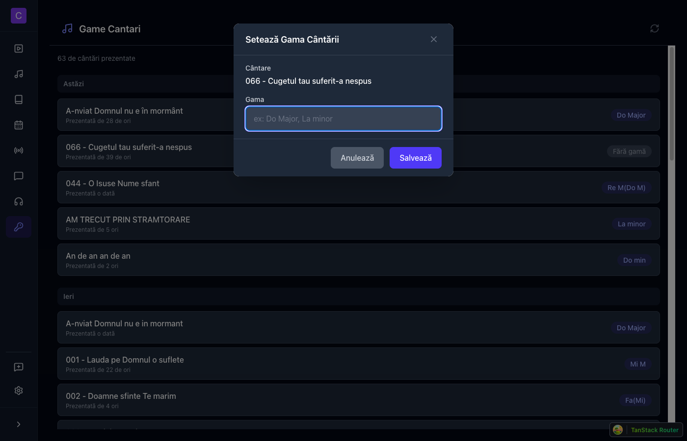

> Track recently presented songs with their musical keys

- 🎼 **Key Display** — Shows musical key for each song
- 📊 **Usage Stats** — Track how often songs are presented
- 📅 **Timeline View** — Organized by date (Today, Yesterday, etc.)
- 🎸 **For Musicians** — Quick reference for band members

---

### 🎨 Screen Editor

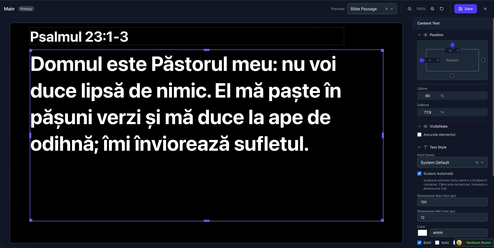

> Visual WYSIWYG editor for customizing presentation layouts

- 📐 **Visual Positioning** — Drag & resize elements on canvas
- 🔤 **Text Styling** — Font, size, color, alignment & shadows
- ✨ **Animations** — Fade, slide & zoom transitions for elements
- 📏 **Auto-Scaling** — Text automatically fits container bounds
- 📝 **Compress Lines** — Optimize text density for readability
- 🎬 **OBS Browser Source** — Embed URL for livestream captions
- 👁️ **Live Preview** — See changes with real content types
- 🖥️ **Multi-Layout** — Edit primary, stage & livestream screens

---

### 🖥️ Control Room Settings

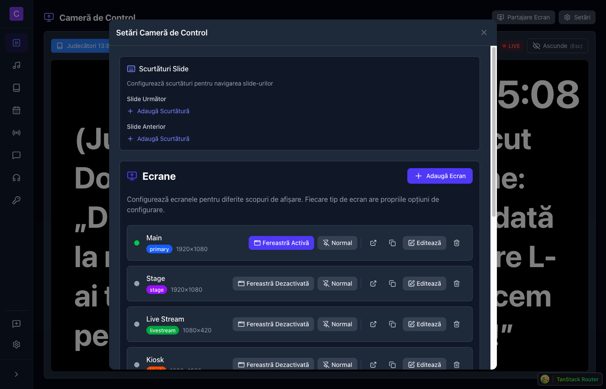

> Configure presentation screens and keyboard shortcuts

- ⌨️ **Keyboard Shortcuts** — Custom shortcuts for next/previous slide
- 🎹 **MIDI Support** — Use MIDI controllers for slide navigation
- 📺 **Multi-Screen Setup** — Main, Stage, Livestream & Kiosk displays
- 🪟 **Window Management** — Launch screens as separate windows
- 📤 **Export/Import** — Share screen configurations
- 🔗 **OBS Browser Source** — Copy URLs for livestream overlays

---

### ⚙️ Settings

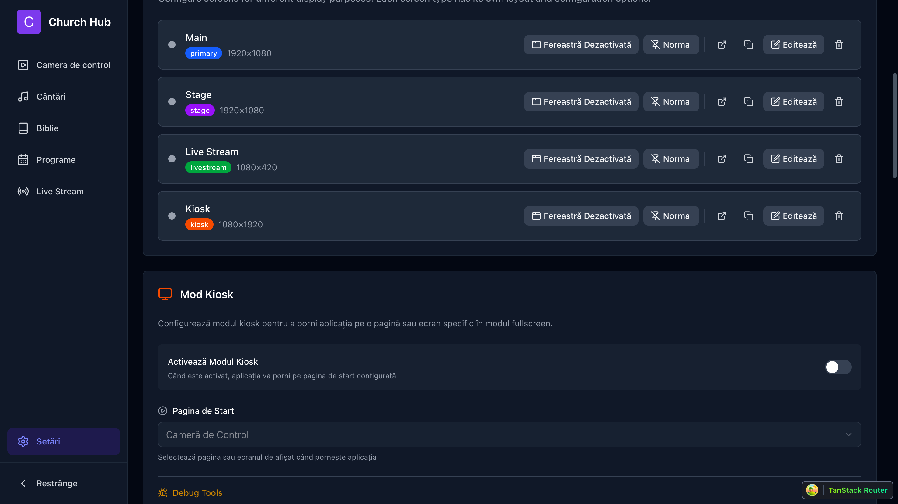

> Configure screens, users, and preferences

- 🖥️ **Screen Setup** — Configure multiple displays
- 👥 **User Management** — Roles & 34+ permissions
- 📱 **QR Login** — Easy mobile authentication
- 🌙 **Dark Mode** — Beautiful dark interface
- 🌍 **Multi-Language** — English & Romanian
- 📄 **Custom Pages** — Add custom menu items with embedded web pages
- 🎛️ **MIDI Controller** — Configure hardware controllers
- 🗄️ **Database Management** — Export/import database backups

---

## 🛠️ Tech Stack

<table>
  <tr>
    <td valign="top">
      <h4>🎨 Frontend</h4>
      <ul>
        <li><b>React 19</b></li>
        <li><b>TypeScript</b></li>
        <li><b>Vite</b></li>
        <li><b>TailwindCSS 4</b></li>
        <li><b>TanStack Router</b></li>
      </ul>
    </td>
    <td valign="top">
      <h4>⚙️ Backend</h4>
      <ul>
        <li><b>Bun</b></li>
        <li><b>Drizzle ORM</b></li>
        <li><b>SQLite</b></li>
        <li><b>WebSocket</b></li>
        <li><b>OpenAPI 3.1</b></li>
      </ul>
    </td>
    <td valign="top">
      <h4>🖥️ Desktop</h4>
      <ul>
        <li><b>Tauri 2.9</b></li>
        <li><b>Rust</b></li>
      </ul>
    </td>
    <td valign="top">
      <h4>🔌 Integrations</h4>
      <ul>
        <li><b>YouTube API</b></li>
        <li><b>OBS WebSocket</b></li>
        <li><b>MIDI</b></li>
      </ul>
    </td>
  </tr>
</table>

---

## 🚀 Getting Started

### Prerequisites

- [Node.js](https://nodejs.org/) (v18+)
- [Bun](https://bun.sh/) (v1.0+)
- [Rust](https://rustup.rs/) (for Tauri builds)

### Installation

```bash
# Clone the repository
git clone https://github.com/radio-crestin/church-hub.git
cd church-hub/app

# Install dependencies
npm install

# Start development (web only)
npm run dev:web

# Start development (desktop app)
npm run dev
```

### Access

- 🌐 **Web**: http://localhost:3000
- 📚 **API Docs**: http://localhost:3000/api/docs

### Logs Path

Application logs are stored at:

| Platform | Path |
|----------|------|
| Windows | `C:\Users\<YOUR_USERNAME>\AppData\Local\church-hub\logs` |
| macOS | `~/Library/Application Support/church-hub/logs` |
| Linux | `~/.config/church-hub/logs` |

---

## 📜 Scripts

| Script | Description |
|--------|-------------|
| `npm run dev` | 🖥️ Desktop development |
| `npm run dev:web` | 🌐 Web development |
| `npm run build:apps` | 📦 Production build |
| `npm run tauri:build` | 🖥️ Desktop build |

---

## 🤝 Contributing

1. 🍴 Fork the repository
2. 🌿 Create your feature branch
3. 💾 Commit your changes
4. 📤 Push to the branch
5. 🔃 Open a Pull Request

---

## 📄 License

MIT License - see [LICENSE](LICENSE) for details.

---

<p align="center">
  Made with ❤️ for churches everywhere
</p>
